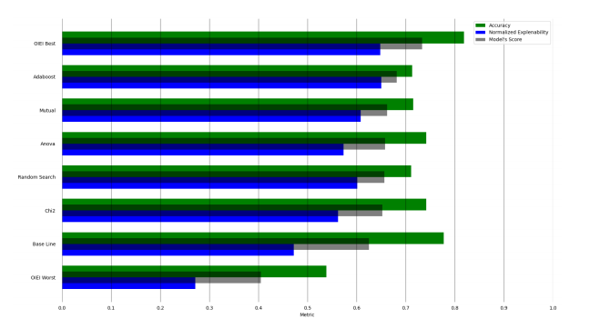

# Balanced Explainability-Performance Feature Selection Algorithm through Iterative Ensemble 


This work is in proceeds of the paper we are prepering in those days. The paper aims to present a new methodoldy on explainability within an transperent models. Our approach is to search only 3 hyper parameters that will serve appropiate performance and explainability. We mainly focus of using an methodlogy of optimization for explainability metric which is a noval for our knowledge. We devlop an Iterative Ensemble of Intersections (IEI) algorithm which is optimized for explainability use case.




### Table of Contents
1. [Prerequisites](#Prerequisites)     
2. [Dataset](#Dataset)
3. [Feature Selection](#Feature_Selection)
4. [OIEI](#OIEI)
5. [Usage](#Usage)

<a name="Prerequisites"/>

## Prerequisites
- Python      3.7
- numpy       1.18.1
- sklearn     0.23.2
- scipy       1.4.1
- seaborn     0.11.0
- matplotlib  3.2.2
- pandas      1.1.5

These can be found in the **requirements.txt** and easly installed using the "pip install requirements.txt" command in your terminal. 


<a name="Dataset"/>

## Dataset

The expirement corpus are 9 different types of datasets.

1. Arcene, Micro-mass, and Ovarian datasets are from the bioinformatics field, and are used to distinguishing cancer patterns in spectrometric data.

2. Ovarian is a well known cancer type that is the fifth most common cause of cancer deaths in women worldwide.

3. Microarray data was derived from hospital laboratory test results. Microarray is a type of medical data that came from the human body according to the gene expression.

4. Dexter is a text classification task as bag-of-word representation.

5. Madelon is an artificial data that containing data points grouped in 32 clusters placed on the vertices of a five dimensional hypercube and randomly labeled +1 or -1.

6. Arrhythmia is a dataset that present the rhythm change of human heart from ECG records. This particular dataset is a multi class problem which class 1 refers to 'normal' ECG test. Classes 2 to 15 refer to different classes of arrhythmia and class 16 refers to the rest of unclassified data.

7. LSVT (Lee Silverman Voice Treatment) is another dataset that predicts Parkinson’s disease using voice recognition. LSVT has been shown to be the best behavioral therapy for speech treatment in the short and long term. 

8. the sonar dataset is used to classifying sonar signals. The task is to train an network to discriminate between sonar signals that bounce off metal cylinders versus signals that bounce off of rock. 

<a name="Feature_Selection"/>

## Feature_Selection

Feature selection algorithms have overall four types - filter, wrapper, embedded, and hybrid. Filter are an statistically methods which are simple and can be intepretate easly. The algorithms in FFS are Mutual information, Anova, and Chi-Square. The input to FFS is the X - Feature space and recorded samples, y is the target we want to predict, test size is the number of samples in validation set, and seed is to split the data in the same order as in all of the algorithms.


- Load Filter_Algorithm

```bash
cd /utils/Feature_Selection.py

X, y = preprocessing(data_path)
FFS  = Filter_Algorithms(X, y, test_size)

# Apply feature selection on the features according the targets
df_Chi2   = FFS.fit_Chi2()
df_Anova  = FFS.fit_Anova()
df_Mutual = FFS.fit_Mutual()


return dataframe of desire algorithm (Chi-square, Anova, Mutual-Information)
```


<a name="OIEI"/>

## OIEI

OIEI is the algorithm for iterative ensemble of feature selection procedure. The algorithm takes several inputs which differ according to the number of feature selection algorithms used in the ensumble. We used in this research three inputs of the feature selection after ranking (Anova, Chi-Square, and Mutual Information). In addition, an optimization layer (currently performed using grid search) finds three hyperparameters as described below.

The three hyperparameters (t_1, t_2, t_3) are as follows. Hyperparameter 1 (t_1) is the final subset we want. It can be a percentage of the features or a fixed number. Hyperparameter 2 (t_2) is the subset of the features (90% or 50%) that takes iteratively with removing or maintain features with hyperparameter 3 (t_3) till convergance to hyperparameter 1. Hyperparameter 3 is the method of selection numbers of features that occurs in the feature selection algorithms. If hyperparameter 3 = 1 it is mean that a least one feature need to be presented in three ranked feature selection algorithms. That mean it is an union operation. Hyperparameter 3 = 2 mean that one feature need to be at least in tow ranked features. Hyperparameter 3 = 3 mean that particular feature need to be in all features rankes, in other words an intersection aggregation.

<a name="Usage"/>

## Run

The Run function in the **expirements** folder contain:
1. Adaboost explainability and performance.
2. IEI optimized explainability and performance.
3. IEI random serach average explainability and average performance.
4. Plot graph of IEI convergnce.


```bash
cd /expirements/run.py


Adaboost(model=DecisionTreeClassifier,performance=get_score, explainability=explainability_metric,
         data_path=data_path, test_size=0.3).fit()


IEI_Grid(IEI            = IEI,
         model          = DecisionTreeClassifier,
         performance    = get_score,
         explainability = explainability_metric,
         overall        = logaritmic_power,
         data_path      = data_path,
         test_size      = 0.3).grid_search()


avg_thresh_1, avg_thresh_2, avg_thresh_3  = IEI_Random(IEI            = IEI,
                                                       model          = DecisionTreeClassifier,
                                                       performance    = get_score,
                                                       explainability = explainability_metric,
                                                       overall        = logaritmic_power,
                                                       data_path      = data_path,
                                                       test_size      = 0.3).random_search()


IEI_plot(IEI=IEI, thresh_1=5, thresh_2=0.9, thresh_3=3, data_path=data_path, test_size=0.3).plot()
```
